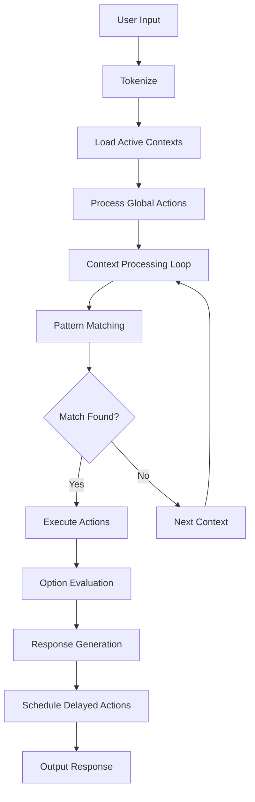

# Moringa Chatbot Engine: Design Document

**Version:** 2.0  
**Date:** May 31, 2026  
**Author:** Moringa Development Team

---

## Table of Contents

1. [Design Rationale](#1-design-rationale)
2. [System Architecture](#2-system-architecture)
3. [MoringaScript Language](#3-moringascript-language)
4. [Command Reference](#4-command-reference)
5. [Processing Model](#5-processing-model)
6. [Data Structures](#6-data-structures)
7. [Extension Points](#7-extension-points)
8. [Performance Considerations](#8-performance-considerations)
9. [Known Issues and Roadmap](#9-known-issues-and-roadmap)

---

## 1. Design Rationale

### 1.1 Why Moringa?

Moringa was designed to bridge the gap between simple rule-based chatbots and complex AI systems. The core philosophy centers on **deductive reasoning** and **contextual awareness** while maintaining **deterministic behavior**.

#### Key Design Principles:

**🧠 Deductive Reasoning Over Pattern Matching**
- Unlike traditional regex-based bots, Moringa uses logical inference
- Conditional logic (`if/then/else`) enables sophisticated decision-making
- Memory system supports context-aware reasoning across conversations

**🔄 Context-Aware Conversations** 
- Multiple conversation contexts with exclusive activation
- Cascading interpretation through context hierarchy
- State preservation across conversation turns

**💾 Persistent Memory with Forgetting**
- Context-specific memory storage and recall
- Deliberate forgetting mechanisms for privacy and relevance
- Variable substitution in memory patterns

**⏰ Temporal Intelligence**
- Built-in scheduling and delayed response capabilities
- Time-based condition evaluation
- Sequence management for complex workflows

**🎯 Deterministic yet Natural**
- Predictable behavior for debugging and testing
- Response variation through weighted options
- Natural conversation flow through expectation management

### 1.2 Design Goals

| Goal | Implementation | Benefit |
|------|----------------|---------|
| **Maintainability** | Declarative MoringaScript syntax | Non-programmers can create/modify bots |
| **Testability** | Deterministic processing model | Reliable testing and debugging |
| **Scalability** | Context-based organization | Large conversation sets remain manageable |
| **Flexibility** | Modular component system | Reusable conversation patterns |
| **Intelligence** | Memory + reasoning system | Context-aware, personalized responses |

### 1.3 Trade-offs Made

**Simplicity vs. Power**
- ✅ Chose: Readable syntax over computational completeness
- ❌ Sacrificed: Complex mathematical operations for pattern clarity

**Determinism vs. Learning**
- ✅ Chose: Predictable behavior over adaptive learning
- ❌ Sacrificed: Dynamic knowledge acquisition for reliable operation

**Structure vs. Flexibility**  
- ✅ Chose: Context-based organization over free-form scripting
- ❌ Sacrificed: Some edge-case handling for architectural clarity

---

## 2. System Architecture

### 2.1 High-Level Architecture

```
┌─────────────────────────────────────────────────────────────┐
│                    Moringa Engine Core                      │
├─────────────────────────────────────────────────────────────┤
│  Input Processing     │  Context Management  │  Scheduling  │
│  • Tokenization      │  • Context Stack     │  • Timers    │
│  • Pattern Matching  │  • Activation Rules  │  • Callbacks │
│  • Variable Capture  │  • Context Switching │  • Delays    │
├─────────────────────────────────────────────────────────────┤
│  Memory System       │  Response Generation │  Script Mgmt │
│  • Storage/Retrieval │  • Option Selection  │  • Parsing   │
│  • Context Isolation │  • Variable Subst.  │  • Merging   │
│  • Pattern Matching  │  • Conjugation      │  • Validation│
└─────────────────────────────────────────────────────────────┘
                                │
                                ▼
┌─────────────────────────────────────────────────────────────┐
│                    Bot Model (Instance)                     │
├─────────────────────────────────────────────────────────────┤
│  Contexts           │  Memory              │  Configuration │
│  • general          │  • Memories[]        │  • Fading Time │
│  • context1         │  • Variables{}       │  • Traces[]    │
│  • context2         │  • Patterns          │  • Schedules[] │
│  • ...              │                      │  • Expects[]   │
└─────────────────────────────────────────────────────────────┘
```

### 2.2 Core Components

#### 2.2.1 Input Processing Pipeline

```javascript
User Input → Tokenization → Context Selection → Pattern Matching → Recognition
                                      ↓
Response Output ← Variable Substitution ← Action Execution ← Option Selection
```

**Tokenization**: Breaks input into words, handles punctuation as separate tokens
**Context Selection**: Determines which contexts are active for processing  
**Pattern Matching**: Evaluates recognizer patterns against input tokens
**Recognition**: Selects best matching recognizer based on pattern length/specificity

#### 2.2.2 Context Management System

```
Context Stack (Most Recent → Least Recent)
┌──────────────┐    ┌──────────────┐    ┌──────────────┐
│   current    │ →  │   previous   │ →  │   general    │
│   context    │    │   context    │    │   (base)     │
└──────────────┘    └──────────────┘    └──────────────┘
```

**Context Activation**: `enter "context"` pushes to stack, becomes most recent
**Context Deactivation**: `exit "context"` removes from stack
**Processing Order**: Contexts processed most-recent-first until match found

#### 2.2.3 Memory Architecture

```
Memory Store Structure:
{
  "context": "general|contextName",
  "memory": "pattern or fact",
  "variables": {...},
  "timestamp": Date,
  "access_count": Number
}
```

**Context Isolation**: Memories are tagged with originating context
**Pattern Storage**: Facts stored as searchable patterns with variable placeholders
**Retrieval**: Pattern matching against stored memories with variable substitution

### 2.3 Processing Flow



---

## 3. MoringaScript Language

### 3.1 Language Philosophy

MoringaScript is a **declarative domain-specific language** designed for conversational AI. It prioritizes:

- **Readability**: Scripts read like conversation specifications
- **Modularity**: Components can be developed and tested independently  
- **Maintainability**: Non-programmers can modify conversation logic
- **Expressiveness**: Rich enough for complex conversational patterns

### 3.2 Syntax Fundamentals

#### 3.2.1 Comments
```
-- Single line comments start with double dash
-- Use for documentation and organization
-- Comments are ignored during parsing
```

#### 3.2.2 Indentation
- **Tabs or 4+ spaces** indicate block structure
- **Consistent indentation** required within blocks
- **Context and sequence blocks** must be indented

#### 3.2.3 String Literals
```
"Standard quoted strings"
'Alternative single quotes'
\-escaping \"quotes\" and \\backslashes
```

### 3.3 Core Language Constructs

#### 3.3.1 Recognizers (Pattern Matching)
```
recognizer "exact phrase to match"
    [actions to execute]

recognizer "pattern with [variable]"
    [actions with variable substitution]

recognizer "choice from [item:option1,option2,option3]"
    [actions with choice validation]
```

**Pattern Types:**
- **Literal**: `"hello"` matches exactly "hello"
- **Variable**: `"my name is [name]"` captures any value into `[name]`  
- **Choice**: `"I like [color:red,blue,green]"` restricts to specific options
- **Multi-word**: Variables capture until next pattern word or end

#### 3.3.2 Contexts (Conversation Modes)
```
context "context_name"
    recognizer "context specific pattern"
        say "This only responds in this context"
        
    recognizer "switch modes"
        exit "context_name" 
        enter "other_context"
        say "Switching contexts"
```

**Context Rules:**
- Only **active contexts** process input
- **"general" context** always active by default
- **Most recently entered** context processed first
- **Context isolation** keeps recognizers separate

#### 3.3.3 Sequences (Reusable Actions)
```
sequence "sequence_name"
    say "First action"
    say "Second action"  
    remember "sequence was executed"

recognizer "trigger sequence"
    do "sequence_name"
```

### 3.4 Variable System

#### 3.4.1 Variable Declaration and Usage
```
recognizer "I am [age] years old and like [food]"
    remember "user age is [age]"
    remember "user likes [food]"
    say "Got it! You're [age] and enjoy [food]."
```

#### 3.4.2 Variable Substitution Rules
- **In patterns**: Variables capture input text
- **In actions**: Variables substitute stored values  
- **Fallback**: Missing variables show `(unknown)` or variable name
- **Scope**: Variables persist within conversation session

#### 3.4.3 Choice Variables
```
recognizer "set mood to [mood:happy,sad,excited,calm]"
    remember "current mood is [mood]"
    say "Mood set to [mood]."
```

---

## 4. Command Reference

### 4.1 Communication Commands

#### 4.1.1 `say` - Immediate Output
```
say "message"                    # Immediate response
say "message with [variable]"    # Variable substitution
say "delayed message" in "5 seconds"        # Scheduled output
say "scheduled message" at "9:00 AM"        # Time-based output
```

**Examples:**
```
say "Hello there!"
say "Welcome, [username]!"
say "Reminder about your meeting" in "10 minutes"
```

### 4.2 Memory Commands

#### 4.2.1 `remember` - Store Information
```
remember "fact"                  # Store simple fact
remember "[variable] is [value]" # Store variable relationship  
remember "user name is [name]"   # Store with variable substitution
```

#### 4.2.2 `recall` - Retrieve Information
```
recall "exact fact"              # Retrieve exact match
recall "[pattern] is [variable]" # Pattern-based retrieval
recall "user name is [name]"     # Retrieve with variable capture
```

#### 4.2.3 `forget` - Remove Information
```
forget "fact to remove"          # Remove specific fact
forget "[pattern]"               # Pattern-based removal
forget "user name"               # Remove user's name
```

**Memory Examples:**
```
recognizer "my name is [name]"
    remember "user name is [name]"
    say "I'll remember your name is [name]."

recognizer "what is my name"
    recall "user name is [name]"
    say "Your name is [name]."

recognizer "forget my name"
    forget "user name"
    say "I've forgotten your name."
```

### 4.3 Flow Control Commands

#### 4.3.1 `do` - Execute Sequence
```
do "sequence_name"               # Execute named sequence
```

#### 4.3.2 `expect` - Set User Expectations  
```
expect "pattern" as "interpretation"     # Set expectation mapping
expect "yes" as "user agrees"           # Map "yes" to agreement
expect "no" as "user disagrees"         # Map "no" to disagreement
```

#### 4.3.3 `interpret` - Reprocess Input
```
interpret as "new meaning"       # Reinterpret current input
```

**Flow Control Examples:**
```
recognizer "start tutorial"
    say "Do you want the beginner or advanced tutorial?"
    expect "beginner" as "start beginner tutorial"
    expect "advanced" as "start advanced tutorial"

recognizer "start beginner tutorial"
    do "beginner_sequence"

sequence "beginner_sequence"
    say "Welcome to the beginner tutorial!"
    say "Let's start with the basics..."
```

### 4.4 Context Commands

#### 4.4.1 `enter` - Activate Context
```
enter "context_name"             # Activate named context
```

#### 4.4.2 `exit` - Deactivate Context
```
exit "context_name"              # Deactivate specific context
exit                             # Deactivate current context
```

**Context Examples:**
```
context "help_mode"
    recognizer "how do I [action]"
        say "To [action], you need to..."
    
    recognizer "exit help"
        exit "help_mode"
        say "Leaving help mode."

recognizer "help"
    enter "help_mode"
    say "Entering help mode. Ask me how to do things!"
```

### 4.5 Response Options

#### 4.5.1 `option` - Basic Response Choice
```
option say "response variant 1"
option say "response variant 2"
option say "response variant 3"
```

#### 4.5.2 `option if` - Conditional Response
```
option if "condition"
    say "conditional response"
    
option if not "condition"  
    say "negative condition response"
```

#### 4.5.3 `always if` - Always Execute if True
```
always if "condition"
    say "this always executes when condition is true"
```

#### 4.5.4 `open` - Fallback Option
```
open
    say "fallback response when no conditions match"
```

**Option Examples:**
```
recognizer "how are you"
    option say "I'm doing great!"
    option say "Pretty good, thanks!"
    option say "Fantastic today!"

recognizer "recommend food"
    option if "user likes pizza"
        say "Try the margherita pizza!"
    option if "user likes sushi"  
        say "The salmon rolls are fresh today!"
    open
        say "What kind of food do you usually enjoy?"
```

### 4.6 Data Initialization Commands

#### 4.6.1 `Memories` - Pre-load Facts
```
Memories
    "fact one"
    "fact two" 
    "category is type"
    "python is a programming language"
```

#### 4.6.2 `Conjugate` - Define Word Relationships
```
Conjugate "I" And "you"          # Bidirectional mapping
Conjugate "my" And "your"        # Possessive mapping
Conjugate "I'm" To "you are"     # Contraction expansion
```

#### 4.6.3 `synonyms` - Define Word Alternatives
```
synonyms "hello" : hi, hey, greetings
synonyms "goodbye" : bye, farewell, later
synonyms "yes" : yep, yeah, sure, absolutely
```

**Initialization Examples:**
```
Memories
    "pizza is food"
    "coffee is a beverage"
    "red is a color"

Conjugate "I" And "you"
Conjugate "am" And "are"

synonyms "hello" : hi, hey, greetings
synonyms "thanks" : thank you, ty, thx
```

---

## 5. Processing Model

### 5.1 Input Processing Sequence

1. **Tokenization**: Split input into words, handle punctuation
2. **Context Loading**: Load all active contexts in recent-first order
3. **Global Processing**: Execute any global-scope actions  
4. **Context Processing**: For each active context:
   - Match against context recognizers
   - Execute first match found
   - Stop processing if match found
5. **Base Processing**: Process general context if no context matches
6. **Response Generation**: Execute chosen recognizer actions
7. **Option Evaluation**: Determine eligible response options
8. **Output**: Generate and send response(s)
9. **Scheduling**: Queue any delayed actions

### 5.2 Pattern Matching Algorithm

```
For each recognizer pattern:
  1. Tokenize pattern into words and variables
  2. Match tokens against input tokens sequentially  
  3. For literal tokens: exact match required
  4. For variables: capture tokens until next literal or end
  5. For choice variables: validate against allowed options
  6. Score match by pattern length and specificity
  7. Select highest-scoring match
```

### 5.3 Memory Operations

#### Storage Process:
1. **Context Tagging**: Tag memory with current context
2. **Pattern Normalization**: Convert to searchable pattern
3. **Variable Extraction**: Identify variable placeholders
4. **Deduplication**: Check for existing similar memories
5. **Storage**: Add to memory store with metadata

#### Retrieval Process:
1. **Pattern Matching**: Search memories for pattern match
2. **Variable Binding**: Capture variables from matched memories
3. **Context Filtering**: Prefer memories from current context
4. **Ranking**: Score by recency, access frequency, relevance
5. **Selection**: Return best match with variable bindings

### 5.4 Option Selection Logic

```
For each option in recognizer:
  1. Evaluate condition (if present)
  2. If condition true or no condition:
     - Add to eligible options list
  3. If no eligible options and "open" option exists:
     - Select "open" option
  4. If eligible options exist:
     - Randomly select from eligible options
  5. Execute selected option actions
```

---

## 6. Data Structures

### 6.1 Bot Model Structure

```javascript
{
  "fading": 60,                    // Memory fade time in minutes
  "contexts": [                    // Array of conversation contexts
    {
      "name": "general",           // Context identifier
      "recognizers": [...],        // Pattern recognizers
      "sequences": [...],          // Named action sequences
      "active": true              // Whether context is active
    }
  ],
  "memories": [                   // Stored facts and patterns
    {
      "context": "general",       // Originating context
      "memory": "user name is Alice", // Stored fact/pattern
      "timestamp": Date,          // When stored
      "accessCount": 5           // How often accessed
    }
  ],
  "conjugations": [...],          // Word relationship mappings
  "synonyms": [...],              // Word alternative mappings
  "schedules": [...],             // Delayed action queue
  "expects": [...]                // User expectation mappings
}
```

### 6.2 Recognizer Structure

```javascript
{
  "pattern": ["my", "name", "is", "[name]"],    // Tokenized pattern
  "matchers": [["my", "name", "is", "[name]"]], // Matching patterns
  "options": [],                                // Response options
  "actions": [                                  // Actions to execute
    {
      "command": "say",                         // Action type
      "param": {
        "message": "Hello [name]!"              // Action parameters
      },
      "flags": [],                             // Action modifiers
      "lineNo": 42                             // Source line number
    }
  ],
  "merging": false                             // Whether being merged
}
```

### 6.3 Memory Entry Structure

```javascript
{
  "context": "general",           // Context where memory was created
  "memory": "user name is Alice", // The stored fact or pattern
  "variables": {                  // Variable bindings
    "name": "Alice"
  },
  "timestamp": "2026-05-31T10:30:00Z", // When created
  "lastAccessed": "2026-05-31T11:15:00Z", // When last retrieved
  "accessCount": 3,              // How many times accessed
  "type": "user"                 // Memory type (user/system/predefined)
}
```

---

## 7. Extension Points

### 7.1 Custom Action Commands

The engine can be extended with new action commands by:

1. **Command Registration**: Add new command types to the parser
2. **Action Handlers**: Implement command execution logic
3. **Parameter Validation**: Define required/optional parameters
4. **Documentation**: Update command reference and examples

Example custom command structure:
```javascript
// Custom action: play "sound_file.mp3"
{
  "command": "play",
  "param": {
    "file": "sound_file.mp3",
    "volume": 0.8
  },
  "flags": ["async"],
  "lineNo": 15
}
```

### 7.2 Plugin Architecture

Future plugin system could support:

- **Context Processors**: Custom context activation logic
- **Pattern Matchers**: Alternative pattern matching algorithms  
- **Memory Stores**: External memory backends (databases, APIs)
- **Response Filters**: Output processing and transformation
- **Event Hooks**: Pre/post processing hooks for actions

### 7.3 Integration Points

Current integration capabilities:

- **JavaScript API**: Full programmatic access to engine
- **Callback System**: Custom response handlers
- **Scheduling Interface**: External timer/scheduler integration
- **Memory Access**: Direct memory manipulation APIs
- **Script Loading**: Dynamic script merging and updating

---

## 8. Performance Considerations

### 8.1 Pattern Matching Performance

**Time Complexity**: O(n*m) where n = number of recognizers, m = pattern length
**Optimization Strategies**:
- Pattern length sorting (longest first)
- Early termination on first match
- Context-based pattern grouping
- Pre-compiled pattern matchers

**Scaling Recommendations**:
- Keep recognizer count per context under 100
- Use specific patterns over broad catch-alls
- Organize related patterns in same context
- Avoid deeply nested variable patterns

### 8.2 Memory System Performance

**Storage Complexity**: O(1) insertion, O(n) retrieval search
**Memory Growth**: Linear with conversation length and fact storage
**Optimization Features**:
- Configurable memory fading (automatic cleanup)
- Access-based memory prioritization
- Context-scoped memory isolation

**Scaling Guidelines**:
- Set appropriate fading timeouts for use case
- Use specific memory patterns over broad recalls
- Implement periodic memory cleanup for long-running bots
- Consider external memory stores for large fact databases

### 8.3 Context Switching Overhead

**Processing Cost**: O(c) where c = number of active contexts
**Optimization**: Most-recent-first processing minimizes average cost
**Best Practices**:
- Limit active contexts to 3-5 simultaneously
- Use specific enter/exit patterns
- Design contexts for mutual exclusivity when possible

---

## 9. Known Issues and Roadmap

### 9.1 Current Limitations

**Critical Issues** (🚨 High Priority):
- Choice variable substitution returns `(unknown)` instead of selected value
- Memory pattern matching returns multiple/incorrect matches  
- Context isolation incomplete - recognizers respond outside intended contexts
- Conjugation syntax parsing errors prevent proper word transformations

**Moderate Issues** (⚠️ Medium Priority):
- Synonym system data structure inconsistencies
- Variable timing expressions in delayed actions not working
- Negative condition evaluation (`not "condition"`) unreliable
- Forget command doesn't actually remove memories from storage

**Minor Issues** (ℹ️ Low Priority):
- Open fallback syntax parsing errors
- Expectation display shows "undefined" values
- Some advanced pattern matching edge cases

### 9.2 Roadmap and Future Enhancements

**Version 2.1** (Q3 2026):
- Fix all critical variable substitution issues
- Implement proper context isolation
- Complete conjugation and synonym systems
- Add comprehensive error reporting

**Version 2.2** (Q4 2026):
- Plugin architecture implementation
- External memory store integration
- Advanced pattern matching algorithms
- Performance optimization for large scripts

**Version 3.0** (Q1 2027):
- Multi-bot conversation support
- Advanced reasoning capabilities
- Machine learning integration points
- Web-based script editor and debugger

### 9.3 Contributing Guidelines

For contributing to Moringa development:

1. **Bug Reports**: Include test cases that reproduce the issue
2. **Feature Requests**: Provide use cases and proposed syntax
3. **Code Contributions**: Follow existing patterns and include tests
4. **Documentation**: Keep this design document updated with changes

---

## Conclusion

Moringa represents a unique approach to conversational AI that balances **deterministic behavior** with **intelligent reasoning**. Its strength lies in providing **structured conversation management** while maintaining **readability and maintainability**.

The MoringaScript language enables non-programmers to create sophisticated chatbots while giving developers the tools to build complex conversational systems. With the critical issues addressed, Moringa is positioned to be a powerful foundation for rule-based conversational AI applications.

**Key Takeaways:**
- **Best for**: Structured conversations, customer service, educational bots, interactive fiction
- **Avoid for**: Open-domain chat, dynamic learning applications, complex natural language understanding
- **Strength**: Deterministic, testable, maintainable conversation logic
- **Future**: Plugin architecture and external integrations will expand capabilities

---

*This document serves as the comprehensive technical reference for Moringa architecture and design. Keep it updated as the system evolves.*